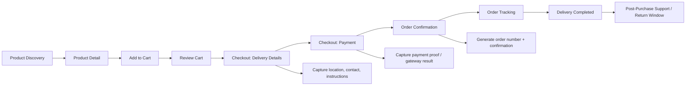
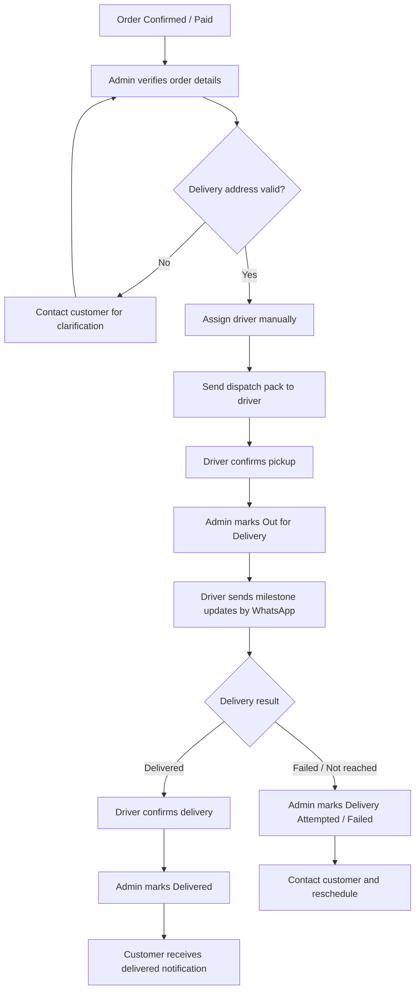
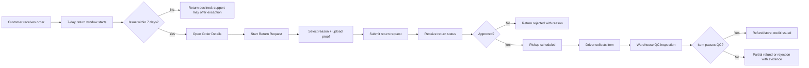

# Operational Framework and Customer Journey Map for Manual Delivery Orders

> **Scope**: End-to-end order, delivery, return, and operational-control framework for Nova Store orders that use an off-system/manual delivery process.  
> **Current system baseline**: The backend already has order creation through `create_order_with_items`, customer-facing order history/details, admin status updates, order status history, shipping address/contact fields, notification templates, and return request endpoints.
>
> **Relevant baseline files**
> - `Backend/sql/011_checkout_orders.sql:26` creates `orders`, including `shipping_address`, `customer_email`, `customer_phone`, `notes`, `status`, `payment_status`, and `order_items`.
> - `Backend/sql/012_orders_management.sql:20` creates `order_status_history` for auditability.
> - `Backend/src/services/order.service.js:74` supports admin status updates and customer notifications for shipped/delivered orders.
> - `Backend/src/services/order.service.js:124` supports customer return requests.
> - `Backend/src/services/order.service.js:170` supports admin return processing: approve, reject, complete.
> - `Backend/src/services/notification.service.js:10` provides in-app/email/SMS notification delivery.
> - `Backend/src/routes/order.routes.js:134` exposes admin order status updates and return processing endpoints.

---

## 1. Executive Operating Model

Nova Store should treat manual delivery as a controlled operational workflow, not as an informal side process. The digital order remains the system of record; the delivery person operates outside the system but must report milestones back into it through a lightweight dispatch interface or admin dashboard.

### Core principles

1. **Every order must have a single source of truth**: the order record, including order number, customer contact, shipping address, notes, status, dispatch owner, driver assignment, and status history.
2. **Every manual action must produce a timestamped record**: dispatch assignment, driver confirmation, pickup time, delivery attempt, delivered/failed result, return approval, collection, QC, refund, and inventory reintegration.
3. **Customers should never see internal confusion**: if the driver is not GPS-tracked, the customer should still receive milestone-based updates such as “packed”, “dispatched”, “out for delivery”, “delivery attempted”, and “delivered”.
4. **Human intervention is expected, but controlled**: manual steps are allowed only at defined checkpoints with clear owners, SLAs, and fallback actions.
5. **Returns must be treated as reverse logistics**: a return is not complete until the item is collected, inspected, inventory is updated, and refund/store credit is resolved.

---

## 2. Digital Ordering Journey

### Customer-facing journey flow



### Step-by-step user experience

| Step | Customer action | System behavior | Required data captured | Manual operations dependency |
|---|---|---|---|---|
| 1. Product discovery | Customer browses products by category, search, recommendation, or campaign link | Product listing displays availability, price, variant options, delivery eligibility if configured | Product ID, variant ID, quantity | Inventory availability should be checked before checkout |
| 2. Product detail | Customer reviews product details, selects variant, checks stock | System validates selected variant and available quantity | SKU/variant, quantity, price snapshot | None unless stock is low or product requires approval |
| 3. Add to cart | Customer adds item to cart | Cart stores product, variant, quantity, unit price, availability check | Cart item data | None |
| 4. Cart review | Customer reviews items, quantities, discounts, delivery estimate | System recalculates subtotal, discounts, shipping cost, tax, total | Cart totals, coupon if used | None |
| 5. Checkout delivery details | Customer enters or confirms delivery information | System validates required delivery fields before payment | Full address, landmark, city/state, GPS pin if available, recipient name, phone, email, preferred delivery window, special instructions | Dispatch team uses these fields to assign a driver |
| 6. Delivery eligibility check | Customer selects delivery option | System checks serviceable area or manual delivery zone | Delivery method, zone, estimated delivery window | Dispatch lead confirms serviceability for ambiguous locations |
| 7. Payment | Customer pays or submits payment proof | System records payment status and creates order atomically with items | Payment reference, payment status, total amount | Finance/admin verifies failed/manual payment exceptions |
| 8. Order confirmation | Customer sees confirmation page | System generates order number, confirmation message, and tracking page | `order_number`, `status`, timestamps | None |
| 9. Post-order tracking | Customer views order status | System displays milestone updates pushed by admin/driver workflow | Current status, estimated delivery window, support contact | Dispatch/admin updates milestones manually |

### Required checkout delivery fields

The checkout form should require and normalize the following fields:

| Field | Required | Validation / UX guidance |
|---|---:|---|
| Recipient full name | Yes | Match person who will receive the package |
| Primary phone number | Yes | Validate format; use for WhatsApp/SMS updates |
| Email address | Yes | Use for order confirmation and receipts |
| Delivery address line 1 | Yes | Street, building, apartment/suite |
| Address line 2 | No | Landmark, floor, gate code |
| City/state/region | Yes | Used for dispatch zone and route planning |
| Location pin / map link | Recommended | Especially important for manual delivery |
| Preferred delivery window | Optional but recommended | Morning, afternoon, evening, or custom |
| Special instructions | Optional | Gate code, nearby landmark, call on arrival, fragile handling |
| Contact alternative | Optional | Backup contact if recipient is unavailable |

### Recommended order data model additions for manual delivery

Add or extend order-related tables so manual delivery becomes auditable:

| Entity / field | Purpose |
|---|---|
| `orders.delivery_status` | Separate operational delivery state from payment/order lifecycle |
| `orders.dispatch_id` | Link to manual dispatch record |
| `orders.driver_name` | Off-system driver name |
| `orders.driver_phone` | Driver contact |
| `orders.dispatched_at`, `out_for_delivery_at`, `attempted_at`, `failed_delivery_at` | Milestone timestamps |
| `orders.manual_dispatch_notes` | Internal notes not shown to customer |
| `delivery_dispatches` | Dispatch record: order, driver, assigned_by, assigned_at, status, route note |
| `delivery_status_history` | Detailed manual delivery milestone history |
| `return_requests` | Structured return request with reason, photos, approval, pickup, QC, refund |
| `return_status_history` | Reverse-logistics audit trail |

---

## 3. Manual Delivery Integration

### Recommended operating model

Use a **lightweight admin dispatch dashboard** as the system of record, backed by **WhatsApp Business** for driver/customer communication. A shared spreadsheet can be used as a temporary fallback, but it should not become the permanent source of truth.

### Manual dispatch workflow



### Order dispatching method

#### Recommended: Admin dashboard + WhatsApp Business

1. Admin opens the dispatch queue.
2. Admin filters orders by status: `confirmed`, `processing`, `ready_for_dispatch`, or `pending_dispatch`.
3. Admin reviews address, contact, payment status, package count, and notes.
4. Admin assigns driver manually.
5. System generates a dispatch pack and sends it to the driver through WhatsApp Business or SMS.
6. Driver replies with a predefined keyword such as `PICKED`, `ON_ROUTE`, `DELIVERED`, `FAILED`, or `CALL_CUSTOMER`.
7. Admin updates the order status from the dashboard or manually from the dispatch sheet.

#### Fallback: Shared dispatch sheet

If the dashboard is not ready, use a shared spreadsheet with controlled columns:

| Column | Purpose |
|---|---|
| Order number | Links to system order |
| Customer name | Recipient |
| Phone | Driver/customer contact |
| Address | Delivery destination |
| Special instructions | Gate code, landmark, delivery notes |
| Package count | Prevents missing items |
| Assigned driver | Off-system owner |
| Driver phone | Backup contact |
| Dispatch time | SLA start |
| Driver pickup confirmation | Manual timestamp |
| Out for delivery time | Customer update trigger |
| Delivery result | Delivered, failed, rescheduled |
| Proof of delivery | Customer signature/photo/OTP |
| Notes | Exceptions |
| Updated by | Audit owner |

### Driver dispatch pack template

Send the driver a structured message:

```text
NEW DELIVERY ASSIGNMENT

Order: {{order_number}}
Customer: {{customer_name}}
Phone: {{customer_phone}}
Address: {{shipping_address}}
Instructions: {{special_instructions}}
Items: {{package_count}}
Payment: {{payment_status}}
Dispatched by: {{admin_name}}
Required update: Reply PICKED when collected, ON_ROUTE when heading to customer, DELIVERED after handoff, or FAILED with reason.
```

### Milestone-based customer updates without GPS

Because the driver is not tracked by GPS, customer communication should be milestone-based:

| Customer status | Meaning | Trigger |
|---|---|---|
| Order confirmed | Payment/order accepted | Checkout completion |
| Processing | Order is being prepared | Admin marks order ready |
| Dispatched | Driver has been assigned | Dispatch assignment |
| Out for delivery | Driver is en route | Driver confirms pickup/on-route |
| Delivery attempted | Customer unavailable or address issue | Driver reports failed attempt |
| Rescheduled | New delivery window agreed | Admin/customer confirms |
| Delivered | Handoff completed | Driver/admin confirms delivery |
| Exception | Manual intervention needed | Address/payment/customer issue |

### Recommended customer notification templates

| Template key | Channel | Message pattern |
|---|---|---|
| `order_created` | Email/SMS/in-app | “Your order {{order_number}} has been confirmed.” |
| `order_processing` | Email/SMS/in-app | “We are preparing your order.” |
| `order_dispatched` | WhatsApp/SMS/in-app | “Your order has been assigned for manual delivery.” |
| `order_out_for_delivery` | WhatsApp/SMS/in-app | “Your order is out for delivery today.” |
| `order_delivery_attempted` | WhatsApp/SMS/in-app | “We attempted delivery. Please contact us to reschedule.” |
| `order_delivered` | Email/SMS/in-app | “Your order has been delivered. Your 7-day return window starts today.” |
| `return_requested` | Email/SMS/in-app | “Your return request has been received.” |
| `return_approved` | Email/SMS/in-app | “Your return has been approved and pickup will be scheduled.” |
| `return_collected` | Email/SMS/in-app | “Your returned item has been collected.” |
| `return_refunded` | Email/SMS/in-app | “Your refund/store credit has been completed.” |

---

## 4. Post-Purchase and 7-Day Returns Protocol

### Return policy summary

| Policy item | Rule |
|---|---|
| Return window | 7 calendar days from the order’s delivered timestamp |
| Eligible orders | Orders with status `delivered` and no prior accepted return |
| Item condition | Unused, undamaged, original packaging, tags/seals intact where applicable |
| Required proof | Order number, reason, photos/video if damaged or incorrect item |
| Approval SLA | Business verifies within 1 business day |
| Pickup SLA | Schedule pickup within 2 business days after approval, where serviceable |
| Refund SLA | Process refund/store credit within 3 business days after QC approval |
| Non-returnable examples | Customized items, hygiene-sensitive items, perishables, damaged-by-customer items, missing accessories |
| Refund method | Original payment method where possible; otherwise store credit |

### Customer return journey



### Structured return workflow

| Stage | Customer action | Business action | System status | Paper trail |
|---|---|---|---|---|
| 1. Request | Customer opens order and submits return reason, photos, preferred pickup window | System validates delivered date and 7-day window | `return_requested` | Return request record, photos, reason |
| 2. Verification | Customer waits for response | Admin reviews order, item condition, photos, reason, policy eligibility | `return_under_review` | Admin note, evidence link |
| 3. Decision | Customer receives approval/rejection | Admin approves, rejects, or requests more information | `return_approved` or `return_rejected` | Decision note, approver, timestamp |
| 4. Pickup scheduling | Customer confirms pickup window | Dispatch assigns driver and shares pickup pack | `return_pickup_scheduled` | Driver assignment, pickup time |
| 5. Collection | Customer hands item to driver | Driver checks item/package and records proof | `return_collected` | Pickup photo/signature/OTP |
| 6. Warehouse QC | Customer waits | Warehouse verifies item condition and completeness | `return_received_qc` | QC checklist, photos |
| 7. Refund | Customer receives refund/store credit | Finance/admin processes refund | `return_refunded` / `return_completed` | Refund reference, amount, timestamp |
| 8. Inventory reintegration | Customer does not see this step | Inventory team marks item sellable, damaged, quarantine, or discard | `inventory_updated` | Stock adjustment reason |

### Return verification checklist

Admin should verify:

| Check | Pass condition |
|---|---|
| Return window | Delivered timestamp is within 7 days |
| Order status | Order is `delivered` and payment is not disputed |
| Item eligibility | Item is returnable under policy |
| Evidence | Photos/video support reason if damage/wrong item |
| Package completeness | Accessories, tags, manuals, seals present where required |
| Customer history | No repeated abuse or suspicious pattern |

### Return logistics and inventory reintegration

| Return condition | Inventory action | Refund action |
|---|---|---|
| Unused, sealed, resellable | Return to active stock | Full refund/store credit |
| Opened but undamaged | Return to active stock only if policy allows | Full or partial refund based on condition |
| Damaged by carrier/delivery | Move to damaged/quarantine stock | Full refund or replacement |
| Customer-caused damage | Quarantine or discard | Reject or partial refund with evidence |
| Wrong item sent by store | Return to active stock or quarantine based on condition | Full refund/replacement; internal error logged |
| Missing parts/accessories | Quarantine | Partial refund or rejection |

---

## 5. Operational Controls

### Lightweight tool stack

| Need | Recommended tool | Fallback |
|---|---|---|
| System of record | Nova Store order/admin dashboard | Supabase table view or admin-only spreadsheet |
| Driver communication | WhatsApp Business | SMS/calls |
| Customer communication | WhatsApp Business + email/SMS/in-app | Manual calls |
| Dispatch queue | Admin dashboard with filters | Shared Google Sheet/Excel Online |
| Return evidence | Uploaded images in return request | WhatsApp Business media folder named by order number |
| Audit trail | `order_status_history`, audit logs, notification logs | Spreadsheet change history + exported logs |
| Daily reconciliation | Admin dashboard report | Daily spreadsheet export |

### Minimum admin dashboard views

| View | Purpose |
|---|---|
| Orders pending dispatch | Orders paid/confirmed but not assigned |
| Orders out for delivery | Active manual deliveries |
| Failed delivery exceptions | Address issues, customer unavailable, driver issues |
| Returns pending review | Return requests awaiting approval/rejection |
| Returns pending pickup | Approved returns awaiting collection |
| Returns pending QC/refund | Collected returns awaiting inspection/refund |
| Orders older than SLA | Prevent lost or forgotten orders |

### Required operational controls

| Control | How it prevents failure |
|---|---|
| Unique order number on every customer message | Avoids confusion between similar names/addresses |
| Mandatory dispatch assignment before delivery | Prevents orders sitting unpaid/unowned |
| Driver confirmation keyword | Creates manual proof of movement |
| Proof of delivery | Prevents false delivery claims |
| Delivery exception categories | Makes follow-up consistent: customer unavailable, wrong address, refused, damaged, phone unreachable |
| Return evidence upload | Reduces disputes |
| Admin approval before pickup | Prevents unauthorized returns |
| QC before refund | Prevents refunding damaged/incomplete items |
| Inventory adjustment reason | Maintains stock accuracy |
| Daily reconciliation | Finds orders without owner, status, or update |
| Permission separation | Prevents unauthorized status/refund changes |

### Daily reconciliation checklist

At the start and end of each delivery day:

1. Review all `pending_dispatch` orders.
2. Confirm every `dispatched` order has a driver assigned.
3. Confirm every `out_for_delivery` order has a last update timestamp.
4. Escalate any active delivery with no update for more than the SLA window.
5. Match delivered orders to proof of delivery.
6. Match failed deliveries to reschedule actions.
7. Match return pickups to collected items.
8. Match collected returns to QC outcomes.
9. Match approved refunds to payment records.
10. Export or archive the day’s dispatch and return records.

---

## 6. Critical Human Intervention Touchpoints

| Touchpoint | Owner | Trigger | Required input | Expected output |
|---|---|---|---|---|
| Address validation | Dispatch/admin | Address incomplete, ambiguous, or outside service area | Customer contact, map pin, landmark | Confirmed address or customer clarification |
| Payment exception review | Finance/admin | Payment failed, pending, or manual proof submitted | Payment reference/proof | Payment accepted or order held |
| Order packing verification | Warehouse/admin | Order ready for dispatch | Order items, SKU, quantity | Packed order with checklist |
| Driver assignment | Dispatch/admin | Order ready and paid | Driver availability, route, capacity | Driver assigned and dispatch pack sent |
| Driver milestone update | Driver/admin | Pickup, route start, delivery attempt, delivery completion | Predefined status keyword | Order milestone updated |
| Failed delivery decision | Dispatch/admin | Customer unavailable, wrong address, refused delivery | Driver note, customer response | Reschedule, cancel, or return-to-store |
| Return evidence review | Admin/support | Customer submits return request | Photos, reason, delivered date | Approved, rejected, or more-info requested |
| Return pickup scheduling | Dispatch/admin | Return approved | Pickup window, driver availability | Pickup assigned |
| Returned item QC | Warehouse/admin | Driver returns collected item | Item, packaging, accessories, photos | Sellable/damaged/quarantine decision |
| Refund approval | Finance/admin | QC complete | Refund amount, payment record | Refund/store credit completed |
| Exception escalation | Ops manager | SLA breach, repeated failed contact, disputed return | Order history, communication log | Resolution owner and next action |

---

## 7. Phased Implementation Strategy

### Phase 0 — Operating rules and data definitions

**Goal**: Define the manual delivery and return rules before building more automation.

**Deliverables**

- Confirm delivery zones, service hours, driver roster, and escalation contacts.
- Define canonical delivery statuses and return statuses.
- Define 7-day return policy text and exceptions.
- Define driver WhatsApp message templates.
- Define proof-of-delivery and return evidence requirements.

**System actions**

- Document status taxonomy.
- Confirm existing order and return fields.
- Identify required new fields/tables.

**Human touchpoints**

- Operations manager approves policy.
- Support/admin confirms customer communication language.
- Warehouse confirms packing and QC checklist.

---

### Phase 1 — Digital order capture and confirmation

**Goal**: Ensure checkout captures enough delivery data for manual dispatch.

**Deliverables**

- Checkout delivery form with required address/contact/instruction fields.
- Order confirmation page showing order number, estimated delivery window, and support contact.
- Customer order history page showing milestone-based status.
- Admin order list with dispatch-relevant filters.

**Backend actions**

- Use existing `orders.shipping_address`, `customer_email`, `customer_phone`, and `notes`.
- Add manual delivery fields if needed: `delivery_status`, `driver_name`, `driver_phone`, `dispatched_at`, `out_for_delivery_at`, `attempted_at`.
- Extend `order_status_history` usage for all customer-visible and internal milestones.

**Operational actions**

- Admin verifies every new paid order before dispatch.
- Dispatch queue is checked at defined intervals.

---

### Phase 2 — Manual dispatch MVP

**Goal**: Prevent lost orders by assigning every ready order to a driver and recording driver updates.

**Deliverables**

- Dispatch queue in admin dashboard.
- Driver assignment flow.
- WhatsApp/SMS dispatch pack template.
- Manual status update actions: `dispatched`, `out_for_delivery`, `delivery_attempted`, `delivered`, `failed_delivery`.
- Proof-of-delivery capture: customer name, signature/photo, OTP, or driver confirmation.

**Backend actions**

- Add admin endpoints or extend existing `PATCH /orders/admin/:id`.
- Reuse `OrderService.updateOrderStatus`.
- Trigger notifications on status changes.
- Log every manual change in `order_status_history`.

**Operational actions**

- Dispatch lead assigns driver.
- Driver sends predefined WhatsApp status updates.
- Admin updates order status from driver messages.

---

### Phase 3 — Customer communication without GPS

**Goal**: Keep customers informed even though the driver is not GPS-tracked.

**Deliverables**

- Customer-facing milestone timeline.
- WhatsApp/SMS/email templates for dispatch, out-for-delivery, attempted, delivered, and exception updates.
- SLA alerts for stale active deliveries.

**Backend actions**

- Add notification templates for manual delivery milestones.
- Add stale-order detection job or admin filter.
- Store notification delivery results where available.

**Operational actions**

- Admin sends customer update when driver milestone is received.
- Support follows up if delivery has no update beyond SLA.

---

### Phase 4 — Structured 7-day returns

**Goal**: Make returns auditable from request to refund and inventory reintegration.

**Deliverables**

- Return request form on order details page.
- Evidence upload or WhatsApp fallback process.
- Admin return review screen.
- Pickup scheduling and driver collection process.
- QC checklist and inventory reintegration workflow.
- Refund/store-credit completion flow.

**Backend actions**

- Use existing `POST /orders/:id/return-request`.
- Use existing `POST /orders/admin/:id/return`.
- Extend return statuses to include `under_review`, `pickup_scheduled`, `collected`, `qc_received`, `refund_completed`.
- Add return evidence and QC tables if file upload is not available.
- Add inventory adjustment reason codes.

**Operational actions**

- Admin approves or rejects within 1 business day.
- Dispatch schedules pickup.
- Warehouse performs QC.
- Finance processes refund.

---

### Phase 5 — Controls, reporting, and continuous improvement

**Goal**: Reduce exceptions and improve delivery/return reliability.

**Deliverables**

- Daily reconciliation report.
- SLA dashboard.
- Lost-order prevention report.
- Return reason analytics.
- Driver performance report.
- Refund aging report.

**Backend actions**

- Add admin reports for pending dispatch, active delivery, failed delivery, return aging, refund aging.
- Add audit exports.
- Add scheduled reminders for stale orders and returns.

**Operational actions**

- Daily ops review.
- Weekly return/dispatch analysis.
- Monthly driver and support performance review.

---

## 8. Suggested Status Taxonomy

### Order lifecycle

| Status | Customer-visible | Owner |
|---|---:|---|
| `pending` | Optional | System |
| `confirmed` | Yes | System/admin |
| `processing` | Yes | Warehouse/admin |
| `ready_for_dispatch` | Yes | Warehouse/admin |
| `dispatched` | Yes | Dispatch/admin |
| `out_for_delivery` | Yes | Driver/admin |
| `delivery_attempted` | Yes | Driver/admin |
| `delivered` | Yes | Driver/admin |
| `cancelled` | Yes | Customer/admin |
| `returned` | Yes | Admin/system |
| `refunded` | Yes | Finance/admin |

### Manual delivery operational status

| Status | Meaning |
|---|---|
| `not_dispatched` | Order is ready but no driver assigned |
| `assigned` | Driver assigned, awaiting pickup confirmation |
| `picked_up` | Driver has the package |
| `out_for_delivery` | Driver is en route |
| `attempted` | Delivery attempt failed |
| `rescheduled` | New delivery time agreed |
| `delivered` | Proof of delivery captured |
| `returned_to_store` | Driver returned package due to failure/refusal |

### Return status

| Status | Meaning |
|---|---|
| `requested` | Customer submitted return |
| `under_review` | Admin is verifying eligibility |
| `approved` | Return approved; pickup can be scheduled |
| `rejected` | Return rejected with reason |
| `pickup_scheduled` | Driver assigned for collection |
| `collected` | Driver collected item |
| `qc_received` | Warehouse received item |
| `refund_pending` | Refund approved but not completed |
| `refund_completed` | Refund/store credit completed |
| `completed` | Return closed |

---

## 9. Visual Customer Journey Map

| Stage | Customer goal | Customer action | System response | Human/ops action | Key touchpoint |
|---|---|---|---|---|---|
| Discover | Find product | Browse/search/filter | Shows products, stock, price | None | Product listing |
| Evaluate | Confirm fit | Open product detail | Shows details, variants, reviews | None | Product detail |
| Buy | Add to cart | Select variant/quantity | Updates cart | None | Cart |
| Checkout | Provide delivery details | Enter address/contact/instructions | Validates required fields | Dispatch later uses address/instructions | Delivery form |
| Pay | Complete purchase | Pay or submit proof | Creates order and confirmation | Finance reviews payment exceptions | Payment/confirmation |
| Wait | Track order | Open order details | Shows status timeline | Admin updates milestones | Order tracking |
| Receive | Get package | Meet driver/receive item | Delivery status updated | Driver/admin records proof | Delivery handoff |
| Return | Resolve issue | Submit return request | Validates 7-day window | Admin verifies evidence | Return request |
| Pickup | Send item back | Hand item to driver | Pickup status updated | Driver collects item | Return collection |
| Refund | Get money/credit | Receive refund update | Refund status updated | Warehouse QC + finance refund | Refund completion |

---

## 10. Implementation Acceptance Criteria

### Digital ordering

- Checkout cannot complete without recipient name, phone, email, delivery address, city/state, and delivery instructions if applicable.
- Order confirmation displays order number, summary, delivery address, support contact, and expected next step.
- Customer order history shows manual delivery milestones.

### Manual delivery

- Every ready order can be assigned to a driver.
- Driver receives a dispatch pack with order number, customer details, address, instructions, and required update keywords.
- Admin can update order status without GPS data.
- Every status update is logged with timestamp and actor.
- Customer receives milestone notifications.

### Returns

- Customer can request a return only within 7 days of delivery.
- Admin can approve, reject, schedule pickup, mark collected, complete QC, and process refund.
- Returned item condition is recorded.
- Inventory is updated only after QC.
- Refund is tied to a refund reference or documented store-credit action.

### Operational controls

- Daily reconciliation report exists.
- No order can remain in active delivery without a last-update timestamp.
- No return can be refunded without collection and QC evidence.
- All manual changes are auditable.
- WhatsApp/spreadsheet fallback process preserves order number, timestamp, actor, and action.

---

## 11. Implementation Gap Analysis

> **Scope reviewed**: Backend migration `047`, order service/controller/routes, delivery dispatch model, return evidence upload route, notification templates, and tests. Frontend remains mostly a Vite shell, so customer/admin UI coverage is not implemented yet.

### 11.1 What is implemented well

| Area | Evidence | Assessment |
|---|---|---|
| Schema extension | `Backend/sql/047_manual_delivery_and_returns.sql:13` adds `delivery_status`, driver fields, return window, evidence, QC fields; `Backend/sql/047_manual_delivery_and_returns.sql:58` adds `delivery_dispatches` | Strong backend foundation for manual delivery and reverse logistics |
| Dispatch API | `Backend/src/routes/order.routes.js:133` adds dispatch queue; `Backend/src/routes/order.routes.js:173` adds ready/dispatch/picked-up/out-for-delivery/attempted/deliver/returned-to-store endpoints | Covers the core manual delivery lifecycle |
| Dispatch record model | `Backend/src/models/delivery-dispatch.model.js:19` creates dispatch rows and `Backend/src/models/delivery-dispatch.model.js:75` updates milestones | Good separation of dispatch audit trail from orders |
| Return evidence upload | `Backend/src/routes/order-return-evidence.routes.js:91` uploads up to 5 images to Supabase storage | Good fallback for customer evidence |
| 7-day return enforcement | `Backend/src/services/order.service.js:367` validates `return_window_expires_at` or `delivered_at + 7 days` | Correctly prevents late return requests |
| Return lifecycle | `Backend/src/services/order.service.js:421` supports review, approve, reject, schedule pickup, collect, QC, refund, complete | Covers most planned reverse-logistics states |
| Notifications | `Backend/sql/047_manual_delivery_and_returns.sql:93` seeds manual delivery and return notification templates | Customer messaging foundation exists |

### 11.2 Critical gaps

| Severity | Gap | Location | Risk | Recommended fix |
|---|---|---|---|---|
| High | Frontend journey is not implemented | `Frontend/src/App.jsx`, `Frontend/src/main.jsx` are shell files | Customers/admins cannot use the backend workflow through the UI | Add checkout delivery form, order tracking timeline, dispatch admin view, return request form, and return status UI |
| High | Return workflow has no state-transition guardrails | `Backend/src/services/order.service.js:425` accepts any action from any current return state | Admin can refund before pickup/QC or jump directly to completion | Add a transition map that validates current `return_status` before each action |
| High | Refund can be marked complete without gateway success | `Backend/src/controllers/order.controller.js:251` catches refund errors but does not stop completion; `Backend/src/services/order.service.js:448` marks `refund_status = completed` | Customer may be told refunded while payment gateway failed | Trigger refund before marking complete, or require successful gateway response/reference before `refund_completed` |
| High | Partial returns are not supported | `Backend/src/services/order.service.js:462` restocks all `order.items` when one item passes QC | Inventory can be overstated for multi-item orders | Add line-item return quantities and restock only returned line items |
| High | Supabase return-evidence bucket is not created by migration | `Backend/src/routes/order-return-evidence.routes.js:23` assumes bucket exists | Upload route will fail in fresh environments | Add setup docs/script to create bucket and policies, or create bucket during deployment |
| Medium | Proof of delivery is optional | `Backend/src/services/order.service.js:299` allows `podType`/`podValue` to be null | Delivery disputes are harder to resolve | Require POD for high-value orders or enforce at least one POD type globally |
| Medium | Returned-to-store delivery does not restore inventory or close dispatch queue | `Backend/src/services/order.service.js:329` only updates `delivery_status` | Undelivered orders can remain stuck in active delivery views | Add `returned_to_store` to order status or filter it out, and add package-received/inventory-restock workflow |
| Medium | Duplicate order history logs on generic status updates | `Backend/src/models/order.model.js:40` logs history and `Backend/src/controllers/order.controller.js:108` logs again | Audit history can be noisy and misleading | Log once either in model or service/controller |
| Medium | Dispatch queue lacks stale-order SLA logic | `Backend/src/models/order.model.js:155` only filters active statuses | Orders can sit unupdated without automatic escalation | Add last-update timestamp and stale filters/alerts |
| Medium | Return evidence is stored as raw URL array on orders | `Backend/src/services/order.service.js:386` writes `return_evidence_urls` to `orders` | Evidence is not modeled as first-class records with metadata, uploader, timestamps, or deletion policy | Add `return_evidence` table |
| Medium | Notification templates use `userName`, but service passes only `orderNumber`/`refundAmount` | `Backend/sql/047_manual_delivery_and_returns.sql:93` templates include `{{userName}}`; `Backend/src/services/order.service.js:203` passes no `userName` | Emails/in-app messages may render blank user names | Pass `userName` in all notification payloads or remove variable from templates |
| Medium | Return evidence upload route returns public URLs before return request exists | `Backend/src/routes/order-return-evidence.routes.js:9` says URLs are later passed to return request | Uploaded files can become orphaned if customer abandons request | Use signed/temporary URLs or associate uploads with a draft return request ID |
| Low | Dispatch pack is not generated/sent automatically | `Backend/src/services/order.service.js:182` creates dispatch record but does not send WhatsApp/SMS | Driver may not receive assignment reliably | Add notification worker or manual dispatch-pack button/template |
| Low | Refund provider support is incomplete | `Backend/src/services/payment.service.js:167` only supports Paystack refunds | Non-Paystack orders cannot be refunded via gateway | Add Stripe/Flutterwave refund support or explicit store-credit path |
| Low | Return status uses `completed` but order status may not become `refunded` | `Backend/src/services/order.service.js:448` sets `refund_status = completed` but not `orders.status = refunded` | Order lifecycle can be inconsistent | Set `orders.status = refunded` only after successful refund or keep status delivered with clear return status |

### 11.3 Tests missing for the implemented workflow

| Missing test | Why it matters |
|---|---|
| Unit tests for `markReadyForDispatch`, `dispatchOrder`, `markPickedUp`, `markOutForDelivery`, `markDeliveryAttempted`, `markDelivered`, `markReturnedToStore` | Confirms manual delivery state transitions and audit logs |
| Unit tests for return transition guardrails once added | Prevents invalid workflow jumps |
| Unit tests for refund failure behavior | Ensures failed gateway refunds do not mark order as refunded |
| Unit tests for partial return inventory restock | Prevents inventory overstatement |
| Integration tests for `/orders/admin/dispatch-queue` | Confirms admin can see active manual delivery work |
| Integration tests for return evidence upload | Confirms Supabase storage behavior and ownership checks |
| Integration tests for customer return request after 7 days | Confirms hard return-window enforcement |
| Integration tests for notification template fallback | Confirms customers are not blocked when templates are missing |

### 11.4 Recommended next implementation priorities

1. Add frontend screens for checkout delivery data, order tracking, dispatch admin view, return request, and return status.
2. Add return workflow transition validation.
3. Fix refund completion so gateway failure does not mark the return as refunded.
4. Add partial-return support with line-item quantities.
5. Add Supabase storage bucket setup/policies for return evidence.
6. Add stale-order/return SLA reporting.
7. Add tests for manual delivery and return lifecycle behavior.

### 11.5 Notifications and Auth Logs Gap Analysis

> **Scope reviewed**: notification schema, templates, user/admin notification routes, email service/logs, Redis notification queue, auth controllers/services/middlewares, admin auth logs, audit logs, sessions, and existing tests.

#### What is implemented well

| Area | Evidence | Assessment |
|---|---|---|
| In-app notification storage | `Backend/sql/016_notifications.sql:31` creates `notifications`; `Backend/src/models/notification.model.js:4` supports list/unread/read/delete | Core in-app notification model exists |
| User notification APIs | `Backend/src/routes/notification.routes.js:46` exposes list, unread count, read, mark-all-read, delete, settings | Customer can manage in-app notifications |
| Email template support | `Backend/src/services/email.service.js:41` renders templates and logs success/failure | Email sending has template-based path |
| Email log table | `Backend/sql/016_notifications.sql:67` creates `email_logs`; `Backend/src/services/email.service.js:77` logs failures | Email delivery paper trail exists |
| Redis notification queue | `Backend/src/services/notification-queue.service.js:22` enqueues jobs; `Backend/src/services/notification-queue.service.js:80` starts worker | Async notification delivery is implemented |
| Admin notification templates | `Backend/src/routes/admin/notification.routes.js:128` exposes template CRUD | Admin can manage templates |
| Admin auth log table | `Backend/sql/030_admin_auth.sql:30` creates `admin_auth_logs`; `Backend/src/services/admin-auth.service.js:23` logs success/failure | Admin login attempts are recorded |
| Audit log table | `Backend/sql/020_audit_logs.sql:1` creates `audit_logs`; `Backend/src/services/audit.service.js:7` writes contextual audit events | General audit trail exists |
| Admin session management | `Backend/src/routes/admin/session.routes.js:33` exposes active/revoke sessions | Admins can inspect and revoke sessions |

#### Critical gaps

| Severity | Gap | Location | Risk | Recommended fix |
|---|---|---|---|---|
| High | Email verification and email-change emails bypass template/log pipeline | `Backend/src/services/email.service.js:17`, `Backend/src/services/email.service.js:100` use raw `transporter.sendMail` without `EmailLogModel.log` | Verification/security emails can fail silently and leave no audit trail | Route all auth/security emails through `sendTemplate` or add explicit log calls |
| High | Auth login failures do not consistently write structured audit/auth logs | `Backend/src/services/auth.service.js:224` skips audit logging; `Backend/src/controllers/auth.controller.js:57` logs only controller-level failure | Failed login attribution can be incomplete, especially service-layer failures | Use `AuditService.logRaw` for failed customer/admin logins, lockouts, and invalid email cases |
| High | Admin auth logging is fire-and-forget and lacks detailed metadata | `Backend/src/services/admin-auth.service.js:23` logs success/failure without awaiting; no status code, failure reason, role, lockout state, or request ID | Forensics are weak after suspicious admin login attempts | Await log writes in a non-blocking bounded queue, add failure reason, status code, role, lockout state, request ID |
| High | Notification queue jobs can be lost after dequeuing | `Backend/src/services/notification-queue.service.js:48` removes jobs before delivery; if process crashes during delivery, job is gone | Critical emails/in-app messages may disappear | Use in-flight/visibility timeout, retry counters, dead-letter queue, and update job status only after success |
| High | No admin endpoint for notification delivery health | `Backend/src/services/notification-queue.service.js:98` has pending count but no route exposes it | Ops cannot detect queue backlog or worker failure | Add admin health endpoint for pending count, last worker heartbeat, failed jobs, dead-letter count |
| Medium | Email send failure is swallowed in notification service | `Backend/src/services/notification.service.js:105` catches errors and returns `false` | Callers cannot know email failed unless they inspect logs | Return structured delivery result or emit failed notification event |
| Medium | Email log model ignores insert errors | `Backend/src/models/email-log.model.js:4` only `console.error`s failed logging | Delivery evidence can be lost if logging fails | Retry/log to audit or return failure status |
| Medium | In-app notifications lack delivery metadata | `Backend/src/models/notification.model.js:72` stores `sent_at` but no provider, template version, request ID, retry count | Hard to trace notification failures | Add `request_id`, `template_version`, `delivery_status`, `last_error`, `retry_count` |
| Medium | Notification settings are coarse and not template-specific | `Backend/sql/016_notifications.sql:17` has only generic email_order_* and sms_order_updates; `Backend/src/services/notification.service.js:60` notes settings are not mapped per template | Users cannot opt out/in by notification type | Add template-category settings or map template keys to preference groups |
| Medium | Broadcast email/SMS is stubbed | `Backend/src/services/notification.service.js:111` only creates in-app broadcast; email/SMS branch is omitted | Admin broadcast cannot reach email/SMS users | Implement queued batched email/SMS broadcast with rate limits |
| Medium | Admin custom notification send creates only in-app record | `Backend/src/controllers/admin/notification.admin.controller.js:21` does not send email/SMS despite `channel` input | Admin “send notification” is misleading | Use `NotificationService.sendToUser` with custom title/message and selected channels |
| Medium | Auth routes log headers in request logger | `Backend/src/middlewares/request-logger.middleware.js:19` logs full request headers | Potential leakage of Authorization/Cookie headers in logs | Redact sensitive headers before logging |
| Medium | Auth sessions are mixed between customer/admin despite table name | `Backend/src/app.js:70` uses `admin_sessions` for all express sessions; `Backend/src/services/auth.service.js:10` stores refresh tokens in `sessions` | Session semantics are confusing and harder to audit | Rename store table or clearly separate customer/admin session stores and logs |
| Medium | Admin login has two possible flows | `Backend/src/routes/admin/auth.routes.js:70` uses `adminAuthController`; `Backend/src/controllers/auth.controller.js:63` has unused `adminLogin` | Inconsistent auth behavior and logging | Remove unused admin login or unify through one flow |
| Medium | Customer login does not log IP/user-agent in user table | `Backend/src/services/auth.service.js:195` accepts `ip`, but controller passes `req.ip` only; `UserModel.resetFailedAttempts` stores `last_login_ip` | Login history is partial | Normalize IP extraction and store IP/user-agent consistently |
| Low | Notification templates ignore `is_active` | `Backend/src/models/notification-template.model.js:14` and `Backend/src/services/notification.service.js:37` do not check `is_active` | Disabled templates may still send | Filter templates where `is_active = true` |
| Low | No tests for notification service/routes/email logs/admin auth logs | Existing tests cover auth basics but not notification delivery or auth-log writes | Regressions can go unnoticed | Add unit/integration tests for notification queue, email logs, auth logs, audit logs |

#### Recommended implementation priorities

1. Redact sensitive headers in request logging.
2. Add structured auth audit logging for customer/admin login success, failure, lockout, password reset, password change, OAuth login, refresh-token failure, and logout.
3. Make admin auth logs awaitable or queue-backed with failure reason, status code, role, lockout state, and request ID.
4. Fix notification queue reliability with in-flight state, retries, and dead-letter queue.
5. Add notification delivery health/admin dashboard endpoint.
6. Route all auth emails through the template/log pipeline.
7. Add notification delivery metadata and active-template enforcement.
8. Add tests for notifications and auth/audit logs.

---

## 12. Open Decisions Before Build

| Decision | Options | Recommendation |
|---|---|---|
| Primary dispatch tool | Admin dashboard, shared spreadsheet, Supabase table view | Admin dashboard for long-term; spreadsheet only as fallback |
| Driver communication | WhatsApp Business, SMS, phone calls | WhatsApp Business plus SMS fallback |
| Proof of delivery | Customer signature, OTP, photo, driver keyword | OTP or customer name confirmation; photo for high-value orders |
| Return evidence | In-app upload, WhatsApp media | In-app upload if frontend supports it; WhatsApp fallback named by order number |
| Refund method | Original payment method, store credit | Original method where possible; store credit as fallback |
| Delivery SLA | Same-day, next-day, custom | Define by zone and driver capacity |
| Return pickup SLA | 24h, 48h, 72h | 2 business days after approval |
