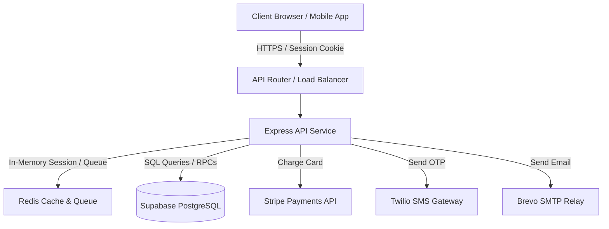
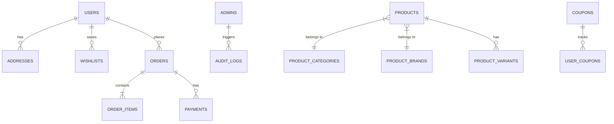

# Architecture & Design Specification

This document details the software architecture, database design layout, and core Architectural Decision Records (ADRs) for the Nova Store platform.

---

## 1. System Topology

Nova Store follows a decoupled, three-tier architecture connecting the public client frontend, a stateless Node.js REST API layer, and managed persistent and cache storage layers.

---

## 2. Database Schema Relationships

The PostgreSQL database maintains separate entities grouped by logical domain:

---

## 3. Architectural Decision Records (ADRs)

### ADR-001: Session-Based HTTP-Only Cookie Authentication

- **Status**: Accepted
- **Context**: Standard REST APIs commonly pass Bearer JWTs in the authorization header. However, storing tokens in browser LocalStorage exposes them to Cross-Site Scripting (XSS) extraction attacks.
- **Decision**: Nova Store uses Express-Session with HTTP-Only, Secure, SameSite-restricted cookies (`connect.sid`) for customer and administrator sessions. Cookies are managed by the browser and are inaccessible to JavaScript.
- **Consequences**:
  - Eliminates LocalStorage token theft risk.
  - Requires Redis or database session persistence (using `connect-pg-simple`).
  - Preserves Bearer JWT parsing as an fallback header option for external/mobile clients.

---

### ADR-002: Segregated Dual-Table Credentials (Customer vs Staff)

- **Status**: Accepted
- **Context**: Combining customer accounts and high-privilege staff profiles into a single `users` table increases the severity of RLS leaks or authorization bypass vulnerabilities.
- **Decision**: Segregate credentials into `users` (customers) and `admins` (staff). Admin panels write to audit tables, lockouts, and credentials entirely independently from customer storefront profiles.
- **Consequences**:
  - Provides maximum database-level segregation.
  - Requires an email-based RBAC bridge middleware (`requireAdmin`) to look up corresponding administrative roles defined on the public schema permission records.

---

### ADR-003: Dynamic Hybrid Product Recommendation Engine

- **Status**: Accepted
- **Context**: Standard storefronts need to present relevant products to users based on interest without invoking expensive, heavy machine learning servers during early-stage scaling.
- **Decision**: Implemented a SQL-backed hybrid recommendation engine tracking telemetry logs (searches and views) over a 30-day sliding window:
  - **Content search boost**: Product name/description matches user queries.
  - **Category/Brand affinity boost**: Recommends products matching categories/brands the user has viewed.
  - **Anti-fatigue penalty**: Lowers score for products the user has recently viewed.
  - **Cold-start fallback**: Recommends popular/highly-rated catalog items if telemetry is empty.
- **Consequences**:
  - Delivers fast, low-latency, personalized recommendations directly from database views.

---

### ADR-004: Atomic Store-Procedure Order Actions

- **Status**: Accepted
- **Context**: In multi-step checkout processes, database connection timeouts or concurrent writes can result in orders created without order items (orphaned records) or double-deductions of stock.
- **Decision**: Enforce atomic database operations using PostgreSQL PL/pgSQL store procedures (e.g., `create_order_with_items`). The entire order and its related list of line items are submitted as a single payload and processed in a database transaction block.
- **Consequences**:
  - Guarantees transactional consistency (All-or-Nothing).
  - Reduces round-trip network overhead between API server and Database.
