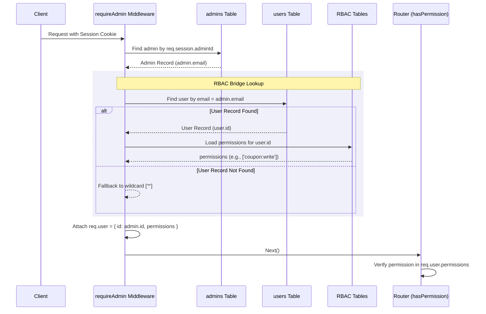

# Authentication Architecture & RBAC Bridge

This document describes the design and implementation of the dual-table authentication system and the Role-Based Access Control (RBAC) bridge used in Nova Store.

---

## 1. The Dual-Table Auth Model

Nova Store maintains two separate tables for authenticating different types of entities:

1. **`users` Table (Public Schema)**
   - **Audience**: Customers / Public Users.
   - **Purpose**: Holds profile data, customer credentials, phone verification tokens, referral codes, and public-facing interactions.
   - **Why**: Keeps customer data isolated from staff members, ensuring standard customers cannot access administrative features even if there are misconfigurations in the router layers.

2. **`admins` Table (Public Schema)**
   - **Audience**: Internal Staff / Administrators.
   - **Purpose**: Holds staff credentials, security locks, and admin console session keys.
   - **Why**: Protects backend internal staff operations and limits access vector risk by segregating customer identity mechanisms from internal staff identity mechanisms.

---

## 2. The RBAC Bridge

Nova Store's RBAC tables (`roles`, `permissions`, `user_roles`, and `role_permissions`) are designed around `users.id` (public schema). Since staff authenticate via the `admins` table, we bridge administrative sessions to DB-defined roles/permissions via the **Email-based RBAC Bridge**.

### How the Bridge Works

1. **Session Authentication**: The `requireAdmin` middleware checks for an active staff session via `req.session.adminId`. It retrieves the admin's database entry.
2. **Email Lookup**: The middleware queries the `users` table using the admin's email (`admin.email`).
3. **Permissions Load**:
   - **If a matching user exists**: The user's ID is used to fetch role-based permissions from `role_permissions` using `permissionModel.getUserPermissions()`.
   - **If no matching user exists**: The system falls back to the wildcard super-admin permission `['*']`. This ensures compatibility with developer seeds and standalone admins.
4. **Context Association**: The permissions list is attached to `req.user.permissions`, unified under the standard `req.user` footprint.

---

## 3. Strict RBAC Enforcement

Previously, `permission.middleware.js` automatically bypassed checking permissions if `req.admin` was present, granting any authenticated admin full access to every endpoint regardless of their specific role.

The bypass has been removed:
- Administrative routes now enforce fine-grained permissions (e.g. `coupon:write`, `settings:write`).
- The unified permissions list on `req.user.permissions` is checked against the required permission key.
- If the permissions do not contain the key or the wildcard `*`, a `403 Forbidden` response is returned.
